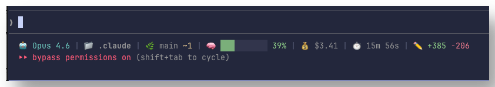

# claudecode

Personal [Claude Code](https://code.claude.com) configuration — custom agents, skills, and global rules for an opinionated AI-assisted development workflow.

## Installation

Clone into your Claude Code config directory:

```sh
git clone git@github.com:jongschneider/claudecode.git ~/.claude
```

### Prerequisites

- [Claude Code](https://code.claude.com) installed
- [ast-grep](https://ast-grep.github.io) CLI (`brew install ast-grep`)
- [trash](https://github.com/sindresorhus/trash-cli) CLI (`brew install trash`)
- [bitbucket](https://github.com/MatanYemini/bitbucket-mcp) CLI — for `/code-review` Bitbucket PR support. Built by wrapping the bitbucket-mcp server with [mcporter](https://github.com/steipete/mcporter/) to produce a standalone CLI binary named `bitbucket`.

## Structure

```
~/.claude/
├── CLAUDE.md              # Global rules for all sessions
├── statusline-script.sh   # Custom status bar script
├── agents/                # Custom subagents
│   ├── code-reviewer.md   #   Read-only code reviewer (bugs, structure, perf)
│   └── oracle.md          #   Senior engineering advisor (opus, read-only)
└── skills/                # Invocable skill packages
    ├── code-review/       #   Parallel 3x review + oracle validation
    ├── commit/            #   Conventional commit from current changes
    ├── index-knowledge/   #   Generate hierarchical CLAUDE.md knowledge base
    ├── spec-planner/      #   Skeptical spec development with decision frameworks
    │   └── references/    #     Templates, estimation, tech debt, decision frameworks
    └── tmux/              #   tmux session management and CLI testing
```

## Configuration

### `CLAUDE.md`

Global rules applied to every session:

- Prefer `ast-grep` over regex for structural code searches
- Never use `rm` — always use `trash`
- Always use detached tmux sessions, never attach directly
- No AI attribution in commits

### Status Line

A custom status bar displayed at the bottom of every Claude Code session. Ported from [ALT-F4-LLC/dotfiles.vorpal](https://github.com/ALT-F4-LLC/dotfiles.vorpal).



**Setup:**

1. The script lives at `~/.claude/statusline-script.sh`
2. Set the `statusLine` setting to point to it (via `claude config set statusLine ~/.claude/statusline-script.sh`, or in `settings.json`)

**Segments displayed:**

| Segment | Description |
|---------|-------------|
| Model | Current model name |
| Agent | Active agent name (if any) |
| Project | Basename of project directory |
| Git | Branch name, staged (+N) and modified (~N) file counts |
| Context | `▓░` progress bar with percentage (green < 70%, yellow 70-89%, red >= 90%) |
| Cost | Session cost in USD |
| Duration | Elapsed session time |
| Lines | Lines added/removed |

**Requirements:** `jq`, `git`

**Note for Nix users:** The script tries GNU `stat -c %Y` before BSD `stat -f %m` for cache file timestamps. If you're on a non-Nix macOS, this still works — the GNU variant fails silently and falls back to BSD.

### `settings.json`

Not tracked (contains MCP server credentials and internal state). Configured separately with:

- **Permissions**: Curated allowlist of safe bash commands (`git`, `ls`, `grep`, `rg`, `go`, etc.) with destructive operations gated behind ask prompts
- **Hooks**: `Stop` hook plays `Glass.aiff` when Claude finishes working
- **Editor mode**: Vim

## Agents

| Agent | Model | Purpose |
|-------|-------|---------|
| **code-reviewer** | Default | Read-only code review focused on bugs, structure, and performance. Write/edit tools disabled. |
| **oracle** | Opus | Senior engineering advisor. Read-only (tools restricted to Read, Grep, Glob, WebFetch, WebSearch). Provides architecture guidance, trade-off analysis, and implementation plans with effort estimates (S/M/L/XL). |

## Skills

| Skill | Description |
|-------|-------------|
| `/code-review` | Spawn 3 parallel reviewer agents, correlate findings, then validate with @oracle |
| `/commit` | Generate a conventional commit message from staged/unstaged changes |
| `/index-knowledge` | Generate hierarchical `CLAUDE.md` documentation for a codebase |
| `/spec-planner` | Develop implementation-ready specs through iterative skeptical questioning |
| `/tmux` | Read from, send commands to, or spin up tmux sessions for CLI testing |

## Credit

Ported from [jongschneider/opencode](https://github.com/jongschneider/opencode). Heavily inspired by [dmmulroy/.dotfiles](https://github.com/dmmulroy/.dotfiles).

## License

MIT
